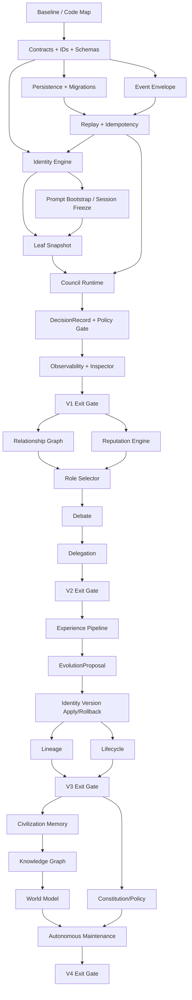

# HAOS Civilization — Dependency Graph e Plano de Paralelismo

## 1. Grafo principal



## 2. Critical path

`F0 → contracts → persistence/event semantics → identity → prompt freeze → Leaf → Council → DecisionRecord → V1 → reputation/selector/debate → V2 → experience/proposal/versioning → V3 → civilization memory/world model + constitution → maintenance → V4`.

Qualquer tentativa de iniciar evolução antes de provenance/idempotency sólidos cria dívida estrutural difícil de remover.

## 3. Lanes que podem rodar em paralelo

### Lane A — Domain/Persistence
Models, migrations, repositories, event envelope, projection/replay.

### Lane B — Runtime Integration
BotSpec compatibility, resolver integration, Agent bootstrap, ShadowLeaf integration.

### Lane C — Council
Council domain, session FSM, debate/consensus, DecisionRecord. Só começa após contracts/event envelope estáveis.

### Lane D — Observability/UI
Trace IDs, metrics, inspector/read-only UI. Pode antecipar interfaces após IDs congelarem.

### Lane E — Harness
Fixtures, replay tests, chaos tests, migration tests e perf baseline. Pode andar desde F0 e deve acompanhar todas as lanes.

### Lane F — Docs/ADR
Atualiza mapping e decisões continuamente; não deve editar contratos sem sincronizar owner.

## 4. Barriers de integração

| Barrier | Bloqueia | Evidência obrigatória |
|---|---|---|
| B0 | qualquer edição estrutural | commit + map real + baseline |
| B1 contracts | services consumidores | schemas + round-trip + compatibility |
| B2 persistence | event consumers/projections | migration + dedupe + replay |
| B3 identity | Leaf/Council identity-aware | isolation + freeze tests |
| B4 Leaf | Council fanout | retry/cancel/restart + lineage |
| B5 Council | V2 | DecisionRecord + crash/recovery + policy separation |
| V1 | V2 | acceptance gate completo |
| V2 | V3 | social evidence/reputation recomputable |
| V3 | V4 | evolution/versioning/rollback sólidos |
| V4 | default-on | full recovery + policy + perf + security |

## 5. Ownership recomendado para execução multi-agent

Um agente pode ser owner de mais de uma lane, mas **um artefato canônico só tem um writer por barrier**. Exemplo:

```text
Agent A: schemas/migrations/event store
Agent B: identity + prompt integration
Agent C: Leaf + Council runtime
Agent D: tests/chaos/benchmarks
Agent E: observability + read-only inspector
Agent F: security/ADR/review
```

Agent B não muda schema diretamente: propõe patch ao owner A. Agent C não redefine IdentityVersion: consome contrato de B/A.

## 6. Anti-paralelismo

Não divida simultaneamente:
- duas migrations concorrentes para as mesmas tabelas;
- duas implementações do IdentityResolver;
- CouncilSession FSM e recovery semantics entre owners diferentes;
- policy enforcement em “prompt team” e “runtime team” separadamente;
- canonical memory model e GraphRAG projection sem contrato de provenance compartilhado.

## 7. Merge strategy

Merge por barrier. Antes de integrar uma lane:
1. sync com barrier branch;
2. executar contract tests;
3. executar focused integration tests;
4. executar replay/idempotency tests se toca estado;
5. verificar feature flag off;
6. registrar status/handoff.
